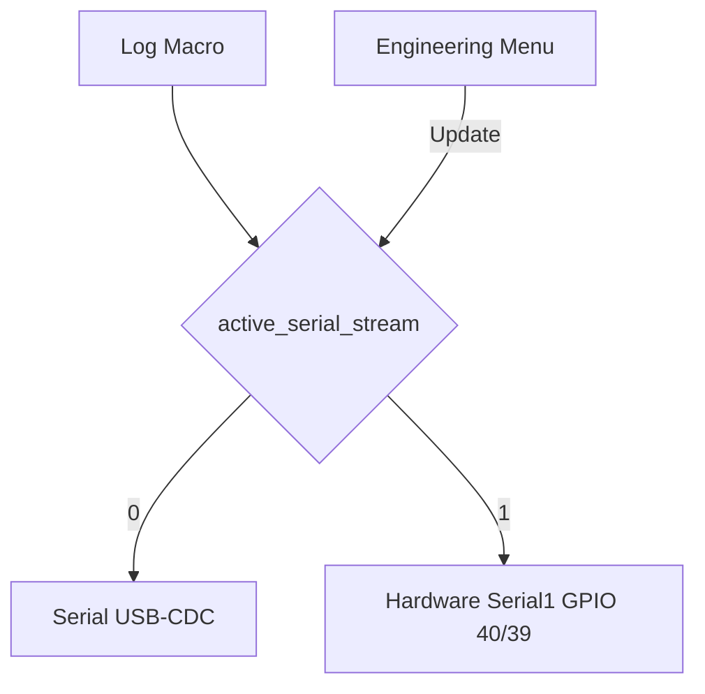

# BISSO E350 Controller - Developer Guide

**Version:** 1.2  
**Last Updated:** January 11, 2026  
**Firmware Version:** See `include/firmware_version.h`  

> **For operators:** See [OPERATOR_QUICKSTART.md](OPERATOR_QUICKSTART.md) for operation instructions.

---

## Table of Contents

1. [Project Overview](#1-project-overview)
2. [Hardware Architecture](#2-hardware-architecture)
3. [Software Architecture](#3-software-architecture)
4. [Development Environment Setup](#4-development-environment-setup)
5. [Code Style Guide](#5-code-style-guide)
6. [Motion Control System](#6-motion-control-system)
7. [Encoder Integration](#7-encoder-integration)
8. [Web Server & API](#8-web-server--api)
9. [Security Implementation](#9-security-implementation)
10. [Testing Framework](#10-testing-framework)
11. [Configuration System](#11-configuration-system)
12. [Debugging & Diagnostics](#12-debugging--diagnostics)
13. [Common Tasks](#13-common-tasks)
14. [System Robustness & Hardening](#14-system-robustness--hardening)
    - [Safety FSM Mutex Protection](#safety-fsm-mutex-protection)
    - [Millis Wraparound (50-Day) Strategy](#millis-wraparound-50-day-strategy)
    - [Serial Output Redirection](#serial-output-redirection-1)

---

## 1. Project Overview

### 1.1 Purpose

The BISSO E350 Motion Controller Firmware is a custom embedded solution designed to upgrade and replace obsolete control systems in industrial bridge saw equipment. It leverages modern ESP32 microcontrollers to manage motion control, safety, and human-machine interfaces.

**Project Codename:** PosiPro

### 1.2 Core Function

The primary purpose is to manage a **single VFD (Variable Frequency Drive) motor** responsible for the primary motion axes (X, Y, Z). The A axis has an optical encoder for position monitoring but is **not motorized**. The system achieves closed-loop control by integrating high-speed communication with the machine's external I/O.

### 1.3 Motion Control Strategy: PLC I/O Emulation

This system operates as a **"smart I/O bridge"**, translating high-level digital commands into low-level binary signals that the machine's legacy PLC expects:

1. **High-Level Command:** System receives commands via CLI or Web interface
2. **Actuation (Output):** ESP32 communicates with 2 PCF8574 I²C output expanders to control PLC signals (axis select, direction, speed profile)
3. **Feedback (Input):** Position tracked via Wayjun WJ66 DRO reader; additional inputs via 2 PCF8574 I²C input expanders

### 1.4 Repository Structure

```
BISSO_E350_Controller/
├── include/              # Header files (75 files)
│   ├── motion.h          # Motion control API
│   ├── encoder_wj66.h    # Encoder driver
│   ├── config_unified.h  # Configuration system
│   ├── web_server.h      # Web server (PsychicHttp)
│   └── ...
├── src/                  # Source files (91 files)
│   ├── main.cpp          # Entry point
│   ├── motion_control.cpp# Motion state machine
│   ├── web_server.cpp    # HTTP handlers
│   └── ...
├── lib/                  # Local libraries
│   ├── TestHelpers/      # Unit test utilities
│   └── TestMocks/        # Hardware mocks for testing
├── data/                 # Web assets (LittleFS)
│   ├── index.html        # Main dashboard
│   ├── bundle.css.gz     # Compressed CSS
│   └── pages/            # Additional pages
├── data_src/             # Uncompressed web assets (development)
├── test/                 # Unit tests
├── platformio.ini        # Build configuration
└── optimize_assets.py    # Asset build script
```

---

## 2. Hardware Architecture

### 2.1 Control Board

| Specification | Detail |
|:---|:---|
| **Model** | KC868-A16 Industrial Controller |
| **Microcontroller** | ESP32 (Dual-core, 240 MHz) |
| **I/O Count** | 16 Opto-isolated Inputs (X1-X16), 16 Digital Outputs (Y1-Y16) |
| **Flash** | 16 MB (3.1 MB for firmware, remainder for filesystem) |
| **RAM** | 320 KB SRAM |

### 2.2 Communication Interfaces

| Interface | Component/Protocol | Purpose | Firmware Modules |
|:---|:---|:---|:---|
| **I²C Bus** | PCF8574 I/O Expanders (x4) | 2 input + 2 output expanders for PLC signals | `plc_iface.cpp`, `i2c_bus_recovery.cpp` |
| **Serial (UART)** | Wayjun WJ66 DRO Reader | 4-axis position data from optical encoders | `encoder_wj66.cpp`, `tasks_encoder.cpp` |
| **RS-485/Modbus** | Altivar 31 VFD, JXK10 Current Sensor, YH-TC05 | VFD telemetry, spindle monitoring | `altivar31_modbus.cpp`, `jxk10_modbus.cpp` |
| **WiFi** | ESP32 onboard | Web interface, OTA updates | `network_manager.cpp`, `web_server.cpp` |
| **NVS** | Internal Flash | Configuration, fault history | `config_unified.cpp`, `fault_logging.cpp` |

### 2.3 Axis Motor Control (Multiplexed)

**Key Principle:** Only ONE axis can move at a time. The PLC contactor system selects which motor receives VFD power.

```
User Command → ESP32 → I²C Expanders → PLC Contactors → Single Axis Motor
                           ↑                              ↓
                    (Axis Select,              WJ66 Encoder Feedback
                     Direction,                     ↓
                     Speed Profile)           ESP32 Position Tracking
```

### 2.4 Spindle Control

**IMPORTANT:** The spindle is controlled by a **separate VFD** that is NOT connected to this controller. The spindle is manually controlled by the operator.

---

## 3. Software Architecture

### 3.1 FreeRTOS Task Structure

| Task Name | Period | Priority | Core | Function |
|:---|:---|:---|:---|:---|
| **Safety** (`tasks_safety.cpp`) | 5 ms | P24 (CRITICAL) | Core 1 | E-Stop, motion stall detection |
| **Motion** (`tasks_motion.cpp`) | 10 ms | P22 (HIGH) | Core 1 | Move execution, axis state machine |
| **Encoder** (`tasks_encoder.cpp`) | 20 ms | P20 | Core 1 | WJ66 DRO polling |
| **PLC_Comm** (`tasks_plc.cpp`) | 50 ms | P18 | Core 1 | I²C I/O expander communication |
| **Monitor** (`tasks_monitor.cpp`) | 1000 ms | P12 | Core 1 | Memory check, telemetry updates |

### 3.2 Key Design Patterns

#### Module State Structs (Preferred Pattern)

Each module encapsulates its state in a static struct with accessor functions:

```cpp
// In .cpp file (private state)
static module_state_t state = {0};
static SemaphoreHandle_t state_mutex = NULL;

// Public accessor (thread-safe)
float moduleGetValue(void) {
    float value = 0.0f;
    if (xSemaphoreTake(state_mutex, pdMS_TO_TICKS(100))) {
        value = state.value;
        xSemaphoreGive(state_mutex);
    }
    return value;
}
```

#### Integer Core, Float Boundaries

The motion control uses **int32_t encoder counts** internally for zero cumulative error:

```
User Input (float MM) → Convert → Motion Buffer (int32_t counts)
                                        ↓
                                 Motion Planner (int32_t)
                                        ↓
                                 Encoder Driver (int32_t)
                                        ↓
                       Convert → Display (float MM)
```

**Why:** 
- Eliminates floating-point accumulation errors
- Hardware native format (WJ66 returns int32_t)
- Faster real-time performance (integer ops vs FPU)
- Perfect accuracy over long jobs

### 3.3 Fault Logging API

All errors route through central fault logging:

```cpp
void faultLogEntry(fault_severity_t severity, fault_code_t code, 
                   int32_t axis, int32_t value, const char* format, ...);
```

- **severity:** Determines action (CRITICAL triggers E-Stop)
- **axis:** 0-3 or -1 for system-wide
- **value:** Raw metric (memory, I2C address, deviation)
- **format:** Printf-style message

---

## 4. Development Environment Setup

### 4.1 Prerequisites

- **PlatformIO:** Install via VS Code extension or CLI
- **Python 3.8+:** For asset build scripts
- **Git:** Version control

### 4.2 Clone and Build

```bash
# Clone repository
git clone https://github.com/your-org/BISSO_E350_Controller.git
cd BISSO_E350_Controller

# Build firmware
pio run

# Build and upload
pio run -t upload

# Upload filesystem (web assets)
pio run -t uploadfs

# Monitor serial output
pio device monitor -b 115200
```

### 4.3 Build Environments (platformio.ini)

```ini
[env:esp32dev]           # Default development build
[env:esp32dev_debug]     # Debug build with extra logging
[env:esp32dev_test]      # Unit test build
```

### 4.4 Key Dependencies

From `platformio.ini`:
- `hoeken/PsychicHttp` - Web server (replaces ESPAsyncWebServer)
- `bblanchon/ArduinoJson@^7` - JSON parsing
- `throwtheswitch/Unity` - Unit testing

---

## 5. Code Style Guide

### 5.1 File Organization

- **Headers (.h):** Type definitions, function declarations, constants
- **Source (.cpp):** Implementation, static module state
- **Naming:** `module_name.cpp` / `module_name.h`

### 5.2 Global Variable Patterns

#### ✅ DO: Group related state into structs

```cpp
typedef struct {
    float speed;
    float current;
    bool fault;
    uint32_t runtime;
} motor_state_t;
static motor_state_t motor = {0};
```

#### ✅ DO: Use static for file-scope globals

```cpp
static module_state_t state = {0};  // File-scope only
```

#### ✅ DO: Provide accessor functions

```cpp
float moduleGetValue(void) {
    return state.value;
}
```

#### ❌ DON'T: Use extern for module state

```cpp
// BAD - exposes internals
extern motor_state_t motor;

// GOOD - controlled access
float motorGetSpeed(void);
```

### 5.3 Thread Safety

- **Spinlocks** for short critical sections (<10μs)
- **Mutexes** for longer operations (I2C, file access)
- **Critical sections** for ISR-safe operations

```cpp
// Spinlock pattern (fast, short operations)
portENTER_CRITICAL(&motionSpinlock);
int32_t pos = axes[axis].position;
portEXIT_CRITICAL(&motionSpinlock);

// Mutex pattern (longer operations)
if (taskLockMutex(taskGetMotionMutex(), 100)) {
    // Critical section
    taskUnlockMutex(taskGetMotionMutex());
}
```

### 5.4 Logging

Use the logging API from `serial_logger.h`:

```cpp
logInfo("[MODULE] Normal operation message");
logWarning("[MODULE] Warning: something unusual");
logError("[MODULE] Error: operation failed");
logDebug("[MODULE] Debug info (only in debug builds)");
```

### 5.5 Boot Log Capture

The system includes a boot log capture feature that saves all serial output during startup to a file on LittleFS. This is useful for debugging boot issues when a serial monitor is not connected.

**Initialization** (in `main.cpp`):
```cpp
// Initialize boot log after serial logger, before other components
serialLoggerInit(LOG_LEVEL);
bootLogInit(32768);  // 32KB max size

// ... other initialization ...

// Stop boot logging before starting tasks (prevents CLI output from being logged)
bootLogStop();
taskManagerStart();
```

**API Functions** (in `serial_logger.h`):
```cpp
bool bootLogInit(size_t max_size_bytes);  // Start capturing boot log
void bootLogStop();                        // Stop capturing and close file
bool bootLogIsActive();                    // Check if currently logging
size_t bootLogGetSize();                   // Get current log file size
size_t bootLogRead(char* buffer, size_t max_len); // Read log contents
```

**Configuration**:
- Enable/disable via `KEY_BOOTLOG_EN` config key (default: enabled)
- Log file stored at `/bootlog.txt` on LittleFS
- Maximum size configurable (default 32KB)
- File is overwritten on each boot

**Access Methods**:
- CLI: `log boot` command
- Web API: `GET /api/logs/boot`
- Web UI: Diagnostics page Boot Log card

---

## 6. Motion Control System

### 6.1 Motion States

```cpp
typedef enum {
    MOTION_IDLE = 0,
    MOTION_WAIT_CONSENSO = 1,
    MOTION_EXECUTING = 2,
    MOTION_STOPPING = 3,
    MOTION_PAUSED = 4,
    MOTION_ERROR = 5,
    MOTION_HOMING_APPROACH_FAST = 6,
    MOTION_HOMING_BACKOFF = 7,
    MOTION_HOMING_APPROACH_FINE = 8,
    MOTION_HOMING_SETTLE = 9,
    MOTION_DWELL = 10,
    MOTION_WAIT_PIN = 11
} motion_state_t;
```

### 6.2 Core Motion API

```cpp
// Movement commands
bool motionMoveAbsolute(float x, float y, float z, float a, float speed_mm_s);
bool motionMoveRelative(float dx, float dy, float dz, float da, float speed_mm_s);
bool motionJog(float dx, float dy, float dz, float da, float speed_mm_s);

// Control commands
bool motionStop();
bool motionPause();
bool motionResume();
void motionEmergencyStop();
bool motionClearEmergencyStop();

// Homing
bool motionHome(uint8_t axis);

// Status
motion_state_t motionGetState(uint8_t axis);
float motionGetPositionMM(uint8_t axis);
bool motionIsMoving();
bool motionIsEmergencyStopped();
```

### 6.3 Motion Buffer

The motion buffer queues commands for sequential execution:

```cpp
// In motion_buffer.h
bool motionBufferPush(int32_t x_counts, int32_t y_counts, 
                      int32_t z_counts, int32_t a_counts);
bool motionBufferPop(motion_command_t* cmd);
bool motionBufferIsFull();
bool motionBufferIsEmpty();
```

### 6.4 PLC Hardware Abstraction

The device uses a custom semantic API to control the PLC contactors via I2C expanders. This layer abstracts direct bit manipulation into hardware-independent calls.

#### Semantic API (Modern)
Preferred for all new development:

```cpp
// In plc_iface.h
void plcSetAxisSelect(uint8_t axis);     // Select axis (0=X, 1=Y, 2=Z, 255=none)
void plcSetDirection(bool positive);     // Set movement direction
void plcSetSpeed(uint8_t speed_profile); // Set speed (0=Fast, 1=Med, 2=Slow)
uint8_t plcGetSpeedProfile();            // Get active speed profile
void plcClearAllOutputs();               // Stop all signals immediately
void plcCommitOutputs();                 // Manual shadow register commit
void plcPrintDiagnostics();              // Detailed IO diagnostics dump
```

#### Legacy API (Deprecated)
The following functions are maintained for backward compatibility but marked with `[[deprecated]]`:

- `elboSetDirection()`: Use `plcSetDirection()` instead.
- `elboSetSpeedProfile()`: Use `plcSetSpeed()` instead.
- `elboGetSpeedProfile()`: Use `plcGetSpeedProfile()` instead.
- `elboQ73SetRelay()`: Use `plcSetOutput()` or `plcSetAuxRelay()` instead.
- `elboDiagnostics()`: Use `plcPrintDiagnostics()` or `systemDumpDiagnostics()` instead.

### 6.5 Adding New Motion Commands

1. Declare in `include/motion.h`
2. Implement in `src/motion_control.cpp`
3. Add CLI command in `src/cli_motion.cpp`
4. Add API endpoint in `src/web_server.cpp`

---

## 7. Encoder Integration

### 7.1 WJ66 Encoder Driver

The Wayjun WJ66 DRO reader consolidates data from 4 optical encoders:

```cpp
// Get encoder position (thread-safe)
int32_t wj66GetPosition(uint8_t axis);

// Get position in millimeters
float motionGetPositionMM(uint8_t axis);

// Check encoder health
bool encoderMotionHasError(uint8_t axis);

// Axis abstraction
float motionGetAxisScale(uint8_t axis);
```

### 7.2 Hardware Abstraction Layer

The encoder HAL allows switching between RS232/RS485:

```cpp
// In encoder_hal.h
void encoderHalInit(encoder_interface_t interface);
bool encoderHalRead(uint8_t* buffer, size_t len);
bool encoderHalWrite(const uint8_t* buffer, size_t len);
```

### 7.3 Calibration

```cpp
// Store pulses per mm calibration
// Accessed via MachineCalibration struct (machineCal) using axes[4] array
machineCal.axes[0].pulses_per_mm = 100.0f; // X
machineCal.axes[1].pulses_per_mm = 100.0f; // Y
machineCal.axes[2].pulses_per_mm = 100.0f; // Z
machineCal.axes[3].pulses_per_degree = 22.222f; // A
```

### 7.4 Protocol Identification

The System provides an identification routine to distinguish between ASCII and Modbus RTU hardware.

**Logic Flow**:
1. Take RS-485 Mutex and pause background polling.
2. Send ASCII Probe (`#xx\r`).
3. Send Modbus Probe (Function 0x03).
4. If ASCII detected but not Modbus, attempt a temporary protocol switch (`$xxP1\r`).
5. Report capabilities and suggested recovery actions (e.g., INIT pin jumper).

---

## 8. Web Server & API

### 8.1 PsychicHttp Server

The web server uses PsychicHttp (replaced ESPAsyncWebServer):

```cpp
// Handler signature
[this](PsychicRequest *request, PsychicResponse *response) -> esp_err_t {
    // Authentication check
    if (requireAuth(request, response) != ESP_OK) return ESP_OK;
    
    // Handle request
    JsonDocument doc;
    doc["status"] = "ok";
    
    char buffer[256];
    serializeJson(doc, buffer, sizeof(buffer));
    return response->send(200, "application/json", buffer);
}
```

### 8.2 Key API Endpoints

| Endpoint | Method | Description |
|:---|:---|:---|
| **System & Status** | | |
| `/api/status` | GET | Comprehensive system health & positions |
| `/api/time` | GET/POST | Read or sync RTC time (ISO8601) |
| `/api/system/reboot` | POST | Safe system restart |
| **Motion & G-Code** | | |
| `/api/jog` | POST | Immediate axis move `{x, y, z, a, speed}`|
| `/api/gcode` | POST | Execute raw G-code line |
| `/api/gcode/state` | GET | Parser state (modal groups, offsets) |
| `/api/gcode/queue` | GET | List queued motion commands |
| `/api/gcode/queue` | DELETE | Abort and clear motion queue |
| `/api/gcode/queue/resume` | POST | Resume from feed-hold/pause |
| **Diagnostics & Logs** | | |
| `/api/faults` | GET/DELETE | Fault history log |
| `/api/faults/clear` | POST | Clear active fault state |
| `/api/logs/boot` | GET/DELETE | Startup serial capture access |
| `/api/io/status` | GET | Raw PCF8574 input/output bitmask |
| **Hardware & Modbus** | | |
| `/api/spindle/alarm` | GET/POST | Spindle overcurrent threshold/status |
| `/api/spindle/alarm/clear` | POST | Reset spindle protection alarm |
| `/api/hardware/pins` | GET/POST | Live pin database (Read/Batch Write) |
| `/api/hardware/pins/reset` | POST | Reset all pin mappings to factory defaults |
| `/api/hardware/io` | GET | Detailed PLC interface diagnostics |
| `/api/hardware/wj66/detect` | POST | Force auto-detection of DRO baud rate |
| `/api/config/detect-rs485` | POST | Scan RS-485 bus for Modbus slaves |
| **Configuration** | | |
| `/api/config/get` | GET | Retrieve all NVS keys |
| `/api/config/set` | POST | Update specific keys |
| `/api/config/batch` | POST | Update multiple keys in one transaction |
| `/api/config/backup` | GET | Export full NVS table as JSON |
| **Updates (OTA)** | | |
| `/api/ota/check` | GET | Query GitHub for new releases |
| `/api/ota/update` | POST | Trigger firmware download and flash |
| `/api/ota/status` | GET | Percent progress of current update |

### 8.3 Adding New Endpoints

1. Add handler in `WebServerManager::setupRoutes()` in `web_server.cpp`
2. Register in endpoint registry (for discovery)
3. Update OpenAPI spec if needed

```cpp
// Example: Add new endpoint
server.on("/api/myendpoint", HTTP_GET, 
    [this](PsychicRequest *request, PsychicResponse *response) -> esp_err_t {
    if (requireAuth(request, response) != ESP_OK) return ESP_OK;
    
    // Implementation
    return response->send(200, "application/json", "{\"result\":\"ok\"}");
});
```

### 8.4 WebSocket Protocol

The system maintains a high-frequency WebSocket connection (default `/ws`) for real-time telemetry.

**Protocol:** JSON over WebSocket  
**Frequency:** 10Hz (100ms) during motion, 1Hz idle.

#### Outbound Messages (Device → UI)

| Message Type | Description | Frequency |
|:---|:---|:---|
| `telemetry` | Axis positions, VFD RPM, Spindle Current | 100ms |
| `state_change` | Motion state transitions (IDLE → MOVING) | Instant |
| `fault` | New fault notification | Instant |
| `ota_progress` | Update download percentage | 500ms |

**Example Telemetry Packet:**
```json
{
  "t": "tel",
  "x": 125.42, "y": 0.00, "z": 80.15, "a": 0.00,
  "rpm": 1450, "amp": 5.2,
  "st": "MOVING",
  "q": 2
}
```

#### Inbound Messages (UI → Device)

| Command | Action | Description |
|:---|:---|:---|
| `stop` | Stop | Immediate deceleration stop |
| `pause` | Pause | Feed hold |
| `resume` | Resume | Release feed hold |
| `ping` | Heartbeat | Keep-alive (optional) |

---

## 9. RS-485 Bus Strategy & Backoff

The RS-485 bus uses a **Priority-Based Dispatcher** with an exponential backoff strategy to prevent faulty devices from starving the bus.

- **High Priority**: WJ66 Encoder (critical for motion).
- **Normal Priority**: Spindle Sensors and VFD.

**Backoff Algorithm**:
- On communication failure, a device's **Backoff Timer** is increased.
- Subsequent requests for that device are skipped until the backoff expires.
- This ensures that a single disconnected or noisy device doesn't cause G-code execution delays.

**RS-485 Sniffer Hook**:
The registry supports a global sniffer callback (`rs485SetSniffer`). When active, the bus manager mirrors all transmitted and received frames to this callback, enabling non-intrusive bus monitoring via the CLI or other diagnostic tasks.

---

## 10. Security Implementation

### 9.1 Credential Storage

All credentials stored in NVS, NOT in source code:

```cpp
// Get credentials
const char* username = configGetStr(KEY_WEB_USERNAME, "admin");
const char* password = configGetStr(KEY_WEB_PASSWORD, "");

// Set credentials
configSetStr(KEY_WEB_PASSWORD, newPassword);
configUnifiedSave();
```

### 9.2 Authentication

HTTP Basic Authentication on all protected endpoints:

```cpp
esp_err_t WebServerManager::requireAuth(PsychicRequest *request, PsychicResponse *response) {
    String authHeader = request->header("Authorization");
    // Validate credentials...
    if (!authenticated) {
        response->addHeader("WWW-Authenticate", "Basic realm=\"BISSO\"");
        response->send(401, "text/plain", "Authentication required");
        return ESP_FAIL;
    }
    return ESP_OK;
}
```

### 9.3 Rate Limiting

API endpoints have rate limiting:

```cpp
if (!apiRateLimiterCheck(API_ENDPOINT_STATUS, 0)) {
    return response->send(429, "application/json", 
        "{\"error\":\"Rate limit exceeded\"}");
}
```

### 9.4 Security Best Practices

- ❌ Never hardcode credentials in source
- ❌ Never log passwords in plain text
- ✅ Use NVS for credential storage
- ✅ Change default passwords immediately
- ✅ Use VPN for remote access (HTTP not HTTPS)

---

## 10. Testing Framework

### 10.1 Unity Test Framework

Tests use Unity with hardware mocks:

```cpp
// In test/test_motion/test_motion.cpp
void test_motion_jog_positive_x() {
    motionInit();
    bool result = motionJog(10.0f, 0.0f, 0.0f, 0.0f, 50.0f);
    TEST_ASSERT_TRUE(result);
}
```

### 10.2 Running Tests

```bash
# Run all tests
pio test

# Run specific test
pio test -f test_motion
```

### 10.3 Mock Objects

Hardware mocks in `lib/TestMocks/`:

- `MockEncoder` - Simulates WJ66 encoder
- `MockI2C` - Simulates I2C bus
- `MockVFD` - Simulates Altivar 31


## 11. Configuration System

### 11.1 Unified Configuration API

```cpp
// Read configuration
int32_t value = configGetInt(KEY_MOTION_SPEED, 100);
float fvalue = configGetFloat(KEY_ENCODER_PPM, 100.0f);
const char* str = configGetStr(KEY_WEB_USERNAME, "admin");

// Write configuration
configSetInt(KEY_MOTION_SPEED, 150);
configSetFloat(KEY_ENCODER_PPM, 105.5f);
configSetStr(KEY_WEB_USERNAME, "operator");

// Persist to NVS
configUnifiedSave();
```

### 11.2 Configuration Keys

Defined in `include/config_keys.h`. Key naming convention:

- `KEY_MOTION_*` - Motion control
- `KEY_ENCODER_*` - Encoder settings
- `KEY_WEB_*` - Web interface
- `KEY_NET_*` - Network settings

### 11.3 Adding New Configuration

1. Add key constant in `config_keys.h`
2. Add default in `config_defaults.h`
3. Use via `configGetXxx()` / `configSetXxx()`

---

## 12. Debugging & Diagnostics

### 12.1 Serial Console

Connect at 115200 baud. Key commands:

| Command | Description |
|:---|:---|
| `help` | List all commands |
| `info` | System information |
| `debug` | Full diagnostic dump |
| `faults` | View fault history |
| `motion` | Motion system status |
| `axis status` | Per-axis status |
| `vfd status` | VFD diagnostics |

### 12.2 Web Diagnostics

Navigate to `/api/docs` for Swagger UI with interactive API testing.

### 12.4 Engineering Menu Framework

The physical UI on the KC868 controller uses a structured menu system built on the **BaseMenu** framework.

#### BaseMenu Utility (`ui_menu_base.h/cpp`)
The `BaseMenu` class provides a foundation for multi-line LCD menus. It handles:
- **I2C LCD Mapping**: Direct integration with the 20x4 LCD.
- **Line Management**: `setLine(row, format, ...)` for easy rendering.
- **Inactivity Tracking**: Automatic timestamping of user interactions.

#### EngineeringMenu Implementation (`engineering_menu.h/cpp`)
The `EngineeringMenu` class inherits from `BaseMenu` and implements a hierarchical state machine:
- **States**: `STATE_MAIN`, `STATE_HARDWARE`, `STATE_DIAGS`, `STATE_SYSTEM`, `STATE_MODBUS_HEALTH`.
- **Navigation Logic**:
    - **nextOption()**: Cycles selection based on the active state's item count.
    - **selectOption()**: Handles transitions between sub-menus and performs actions (toggles, reboots).
- **Physical Feedback Integration**:
    - **Buzzer**: Selection and navigation beeps via `operator_alerts.h`.
    - **Tower Light**: Maintenance mode (Yellow) trigger via `operator_alerts.h`.
- **EMI Protection**: Uses a 15ms stable-state debouncer for the `BOOT` button to ignore industrial noise.

#### Adding New Sub-Menus
1.  Add a new value to the `MenuState` enum in `engineering_menu.h`.
2.  Update `nextOption()` to define the number of items in the new state.
3.  Implement the action logic in `selectOption()`.
4.  Define the layout in `refreshMenuLines()`.

#### Real-time I/O View
The `STATE_IO_VIEW` provides a live bitmask display of the I2C input and output expanders:
- **IX (X1-X16)**: Shows the 16-bit state of the digital inputs (0x21 and 0x22).
- **QY (Y1-Y16)**: Shows the 16-bit state of the relay outputs (0x24 and 0x25).

#### LCD Menu Layout (v2.4)
```text
ENGINEER MENU (3x BOOT Click)
├── 1. Hardware CTRL
│   ├── 1. Serial: [USB/UART]
│   ├── 2. Lights: [ON/OFF]
│   ├── 3. VFD: [ON/OFF]
│   └── 4. BACK
├── 2. Diagnostics
│   ├── 1. View Alarms (Fault Ring Buffer)
│   ├── 2. LogLvl: [DEBUG/INFO]
│   ├── 3. Modbus Health (Slave Poll Stats)
│   ├── 4. Live I/O View (16-bit IX/QY)
│   ├── 5. Diag Dump (Serial Trigger)
│   └── 6. BACK
├── 3. System Utils
│   ├── 1. Reboot
│   ├── 2. Factory Reset (NVS Erase)
│   └── 3. BACK
└── 4. EXIT
    └── [EXIT / SAVE CHANGES?]
```

---

## 13. Common Tasks

### 13.1 Adding a New CLI Command

1. Create handler in appropriate `cli_*.cpp` file:
```cpp
void cmd_mycommand(int argc, char** argv) {
    if (argc < 2) {
        logPrintln("Usage: mycommand <arg>");
        return;
    }
    // Implementation
}
```

2. Register in `cli_init()`:
```cpp
cliRegisterCommand("mycommand", cmd_mycommand, "Description");
```

> [!NOTE]
> **Atomic Usage Printing**: When implementing subcommands, the `cliDispatchSubcommand` helper uses a dynamic buffer (PSRAM) to build the entire help message before printing. This prevents log interleaving when multiple tasks are printing to the serial port simultaneously.

### 13.2 Adding a New Configuration Option

1. Add key in `config_keys.h`:
```cpp
#define KEY_MY_OPTION "my_option"
```

2. Use in code:
```cpp
int value = configGetInt(KEY_MY_OPTION, 42);  // 42 = default
```

### 13.3 Updating Web Assets

1. Edit files in `data_src/`
2. Run `python optimize_assets.py`
3. Upload: `pio run -t uploadfs`

### 13.4 Building for Production

```bash
# Clean build
pio run -t clean

# Build release
pio run

# Verify size
# RAM: <50% recommended
# Flash: <80% recommended
```

---

## Appendix A: Key Files Reference

| File | Purpose |
|:---|:---|
| `main.cpp` | Entry point, task initialization |
| `motion_control.cpp` | Motion state machine, move commands |
| `motion_buffer.cpp` | Command queue |
| `motion_planner.cpp` | Real-time motion execution |
| `encoder_wj66.cpp` | WJ66 DRO driver |
| `web_server.cpp` | HTTP server, API endpoints |
| `config_unified.cpp` | NVS configuration system |
| `fault_logging.cpp` | Fault recording and history |
| `tasks_*.cpp` | FreeRTOS task implementations |
| `plc_iface.cpp` | I2C I/O expander control |
| `altivar31_modbus.cpp` | VFD Modbus communication |

---

## Appendix B: Security Checklist

Before deployment:

- [ ] Change default web password (`web_setpass <password>`)
- [ ] Change default OTA password (`ota_setpass <password>`)
- [ ] Configure WiFi credentials
- [ ] Verify network is isolated (not internet-facing)
- [ ] Test E-Stop functionality
- [ ] Verify encoder calibration

---

**Document maintained by:** BISSO Development Team  
**Last audit:** January 2026

---

## Appendix C: GitHub OTA Updates

### Overview
The firmware includes an automatic update checker that queries the GitHub Releases API.

### How it Works
1.  **Auto-check on load:** When the web UI is opened, the `router.js` fetches `/api/ota/check`.
2.  **Version comparison:** The backend compares the GitHub `tag_name` with the current firmware version.
3.  **User notification:** If a newer version is found, a banner appears at the top of the dashboard.
4.  **One-click update:** The user clicks "Install Now", triggering a POST to `/api/ota/update`.
5.  **Safe flash:** The new firmware is written to the inactive OTA partition (`ota_1`), and the device reboots.

### Key Files
- `include/ota_manager.h`, `src/ota_manager.cpp`: Core logic.
- `src/web_server.cpp`: API endpoints (`/api/ota/check`, `/api/ota/update`, `/api/ota/status`).
- `data/shared/router.js`: Frontend notification logic.

---

## Appendix D: RS485 Baud Rate Autodetect

### Overview
The RS485 autodetect feature scans common baud rates (4800-115200) to find connected Modbus devices.

### Usage
1.  Enable VFD or JXK-10 on the Hardware page.
2.  Click "Detect" next to the RS485 Baud Rate dropdown.
3.  The system will probe for devices and set the baud rate automatically.

### Key Files
- `include/rs485_autodetect.h`, `src/rs485_autodetect.cpp`: Scan logic.
- `src/web_server.cpp`: API endpoint (`/api/config/detect-rs485`).
- `data/pages/hardware/hardware.js`: Frontend button handler.

---

## Appendix E: Custom Partition Layout

The device uses specific partition layouts depending on the hardware revision:

### v1.6 Hardware (4MB Flash)
Uses a **Single-App layout** to maximize space for firmware and Web UI assets. OTA is not supported on this revision due to 4MB flash constraints combined with a large LittleFS partition.

| Partition | Size | Purpose |
|:---|:---|:---|
| `nvs` | 20 KB | Configuration storage |
| `phy_init` | 4 KB | Radio configuration |
| `factory` | 2,048 KB | Primary application binary |
| `spiffs` | 1,984 KB | LittleFS for web UI assets |

### v3.1 Hardware (16MB Flash)
Uses a **Standard 16MB OTA Layout** (`default_16MB.csv`). This takes advantage of the larger flash to provide full A/B OTA updates and a much larger LittleFS storage area (typically ~10MB).

To modify, edit the appropriate `.csv` file in the project root or platformio configuration. Note that changing the partition table will erase all data.

---

## Appendix F: Automated Releases via GitHub Actions

### Overview
The project includes a GitHub Actions workflow (`.github/workflows/release.yml`) that automatically builds and publishes firmware releases.

### How to Create a Release

1.  **Update version** in `include/firmware_version.h`:
    ```cpp
    #define FIRMWARE_VERSION_MAJOR      1
    #define FIRMWARE_VERSION_MINOR      0 
    #define FIRMWARE_VERSION_PATCH      1  // Bump this
    ```

2.  **Commit and tag:**
    ```bash
    git add .
    git commit -m "Release v1.0.1"
    git tag v1.0.1
    git push origin main --tags
    ```

3.  **GitHub Actions will automatically:**
    - Build the firmware using PlatformIO
    - Create a GitHub Release named `v1.0.1`
    - Attach `firmware.bin` to the release

4.  **Devices** running older firmware will detect the new release via the OTA checker.

### Workflow File
Located at `.github/workflows/release.yml`. Triggered by tags matching `v*`.

---

## Revision History

| Date | Changes |
|------|---------|
| 2026-02-17 | Implementation: Added Modbus Sniffer diagnostic tool and global RS-485 hook |
| 2026-02-17 | Refactor: Deprecated legacy PLC API; added semantic `plcSet*` / `plcGet*` API documentation |
| 2026-02-15 | Audit: Updated MachineCalibration refactor, RS-485 backoff, and CLI hardening details |
| 2026-01-25 | Initial guide structure |
---

## 14. System Robustness & Hardening

As an industrial controller, system uptime and state integrity are paramount. Several architectural safeguards have been implemented to ensure continuous operation for weeks or months.

### Safety FSM Mutex Protection

The **Safety State Machine** (FSM) is the core arbiter of motion permission. To prevent race conditions between the high-priority Safety Task (Core 1) and user-facing API/CLI tasks (Core 0), all state transitions are protected by a **Recursive Mutex**.

*   **Logic**: `safety_state_machine.cpp`
*   **Mechanism**: `safetyStateLock()` and `safetyStateUnlock()`.
*   **Safety Invariant**: No motion actuation (PLC signals) can be modified without holding the Safety FSM mutex. This ensures that a fault detected on Core 1 immediately invalidates any motion requests partially processed on Core 0.

### Millis Wraparound (50-Day) Strategy

The Arduino `millis()` function overflows every ~49.7 days. The firmware handles this using the standard **Unsigned Subtraction Pattern**, which is naturally wraparound-safe.

**Standard Pattern:**
```cpp
uint32_t now = millis();
if (now - last_update >= interval) {
    // This calculation works correctly even if 'now' has wrapped back to 0
    // while 'last_update' is still near 0xFFFFFFFF.
}
```

**Advanced Hardening**:
For long-running timeouts (e.g., maintenance alerts or system logs), the controller uses a **64-bit millisecond counter** (`uint64_t`) maintained by a background task. This extends the wraparound period to over 500 million years, effectively eliminating the issue for the life of the hardware.

### Serial Output Redirection

The system supports dynamic redirection of logger output to allow for flexible field deployments.

*   **Mechanism**: The `SerialOut` macro in `serial_logger.h` resolves to a `Stream*` pointer (`active_serial_stream`).
*   **Runtime Switching**: The `serialLoggerSetStream(Stream* new_stream)` function allows swapping from `Serial` (USB-CDC) to `Serial1` (Hardware UART) at runtime.
*   **Persistence**: The preference is stored in NVS (`serial_dest`). To prevent accidental writes, the system uses a **Two-Stage Confirmation Menu** on the hardware LCD:
    1.  **Main Menu**: Adjust settings in-memory (applied to runtime immediately).
    2.  **Confirmation Screen**: Triggered on 5s inactivity if settings changed. User must explicitly select "SAVE" to write to NVS.



### RS485 DMA Technical Note

As of February 2026, the RS485 bus explicitly uses the interrupt-driven `HardwareSerial` (FIFO) rather than DMA. 

**Rationale for avoiding DMA:**
- **Industrial Reliability**: The standard interrupt-driven approach is simpler and less prone to edge-case failures in high-EMI environments.
- **Modbus RTU Timing**: DMA struggles with Modbus's requirement for a 3.5-character "silent gap" to identify frame ends, requiring complex IDLE-line interrupt handling that adds more failure points than it resolves.
- **Buffer Locality**: DMA requires internal SRAM buffers, which would increase pressure on the controller's limited internal memory compared to the current implementation.

---
