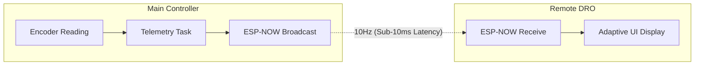

# Remote DRO System Reference

This document provides a comprehensive technical overview and operational guide for the **BISSO E350 Remote DRO Receiver**. 

The system leverages **ESP-NOW**, a low-latency, connectionless protocol, to broadcast real-time machine coordinates from the main E350 Controller to dedicated remote display units based on the ESP32-C3 architecture.

---

## 1. Hardware Specifications

### Main Receiver Board
- **Microcontroller**: ESP32-C3 (RISC-V Single-Core, 160MHz)
- **Features**: 2.4GHz WiFi, BLE 5.0, 4MB Flash
- **Crystal**: 40MHz
- **I2C Protocol**: Fast Mode (400kHz)

### Integrated Display (SSD1306)
- **Physical Size**: 0.42" Diagonal
- **Physical Matrix**: 72 x 40 pixels
- **Controller Buffer**: 128 x 64 pixels
- **Interface**: I2C (Address 0x3C)
- **Pins**: SDA (GPIO 5), SCL (GPIO 6)

---

## 2. System Architecture

The main E350 Controller acts as the **Broadcaster**, and one or more Remote DRO units act as **Receivers**.

### Data Flow


### Telemetry Packet Structure
The `TelemetryPacket` is a bit-perfect C-structure shared between broadcaster and receiver:
```cpp
struct TelemetryPacket {
    float x;           // X Axis Position (mm)
    float y;           // Y Axis Position (mm)
    float z;           // Z Axis Position (mm)
    uint8_t status;    // 0:READY, 1:MOVING, 2:ALARM, 3:ESTOP
    uint32_t uptime;   // Controller uptime in seconds
} __attribute__((packed));
```

---

## 3. Display Layouts (ASCII Reference)

The system features three distinct display modes optimized for the unique 72x40 physical window.

### A. Boot Animation (Two-Stage)
Displayed during the first 2 seconds of power-up.

**Stage 1: SAW Logo**
```text
  (28,26) ______________________
         |        /|            |
         |      /  |            |
         |    /____|            |
         |         |            |
         |______________________| (100,66)
```

**Stage 2: POSIPRO + Version**
```text
  (28,26) ______________________
         |   P O S I P R O      |
         |                      |
         |                      |
         |        v1.0.0        | (Center-Bottom)
         |______________________| (100,66)
```

### B. Standard View (3-Axis Overview)
Displayed when the machine is idle or multiple axes are stable.

```text
  ______________________
 | READY          45s   | <- Status & Controller Uptime
 | X:   1250.5          |
 | Y:    450.0          |
 | Z:     30.2          |
 |______________________|
```

### C. Giant-Text Mode (Active Movement)
Triggered automatically when an axis moves >0.5mm. Reverts 1s after movement stops.

```text
  ______________________
 | [ARROW]       X  [-] | <- Direction, Axis, Sign
 |                      |
 |                      |
 |              1250.5  | <- Large Numeric (Right Aligned)
 |______________________|
```

---

## 4. Technical Configuration (The "Golden Setup")

To achieve perfect physical centering on the 0.42" OLED, specific offsets must be applied to the 128x64 internal buffer:

- **OLED_X_OFFSET**: `28`
- **OLED_Y_OFFSET**: `12` (Stable for text)
- **LOGO_Y_OFFSET**: `26` (Shifted for visual center)

### Build Environment
In `platformio.ini`, use the following profile:
```ini
[env:remote_dro]
platform = espressif32
board = esp32-c3-devkitm-1
build_flags = 
    -DOLED_SDA=5
    -DOLED_SCL=6
lib_deps =
    adafruit/Adafruit SSD1306
    adafruit/Adafruit GFX Library
```

---

## 5. Troubleshooting Guide

| Issue | Possible Cause | Solution |
| :--- | :--- | :--- |
| **Display is Black** | Incorrect I2C Address or Wiring | Verify `0x3C` address in `display.begin()`. Check SDA/SCL pins. |
| **"OFFLINE" Message** | No telemetry signal | Ensure main controller is running and `tasks_telemetry.cpp` is active. |
| **Garbled Graphics** | Buffer Mismatch | Ensure `SCREEN_WIDTH 128` and `SCREEN_HEIGHT 64` match controller specs. |
| **Flickering UI** | High TX Power Interference | The firmware reduces power via `WiFi.setTxPower(WIFI_POWER_8_5dBm)`. Do not increase this. |
| **Text Clipped at Top** | Incorrect Y Offset | Validate `OLED_Y_OFFSET` is at least `12`. |

---

## 6. Maintenance & Logo Customization

To change the boot logos:
1. Prepare a 72x40 PNG image.
2. Run the `convert_logo.py` script:
   ```bash
   python convert_logo.py > src/remote_dro/logos.h
   ```
3. The script automatically handles:
   - Transparency flattening.
   - Aspect ratio preservation.
   - Centering within the 72x40 frame.
   - MSB-first bit-packing required by Adafruit GFX.

---
*Documentation Version: 1.0.0*
*Board: ESP32-C3 0.42 OLED v0.4*
